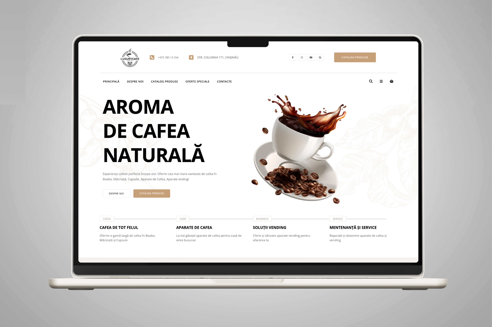

- **This project is a recreation of an existing website created for educational and portfolio purposes. It is not affiliated with the original brand or website**

## UI Preview

<p align="center">
 
</p>

# Simple Project Template PHP

## The project contains:

- **MVC Architecture**
- **PHP Router**
- **Authentication System**
- **User Roles**
- **Dashboard**

_To get the project running follow these steps:_

---

## 1. Start the project

```bash
docker-compose up -d
```

## 2. Run database migrations

```bash
    docker exec -it luxary-coffee-apache bash
    php migrate.php
```

## 3. Seed initial roles

```bash
    INSERT INTO roles(name) VALUES ("user"), ("admin");
```
